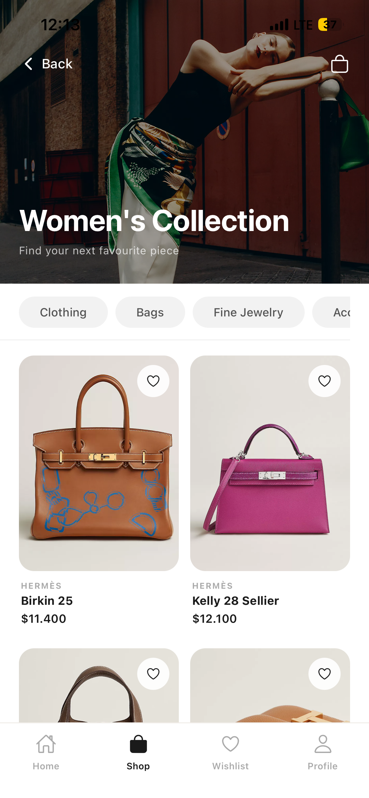
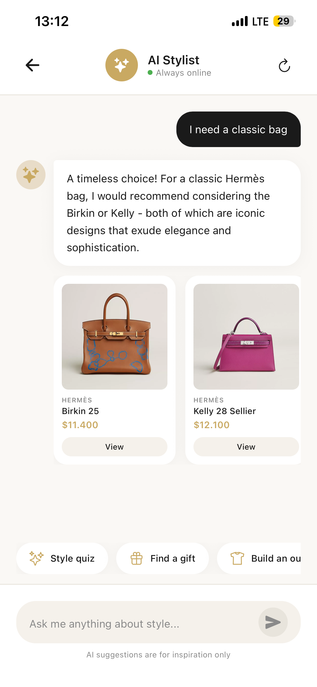
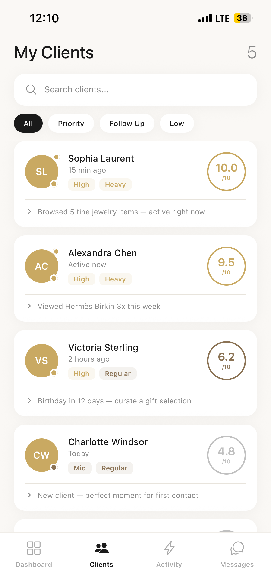
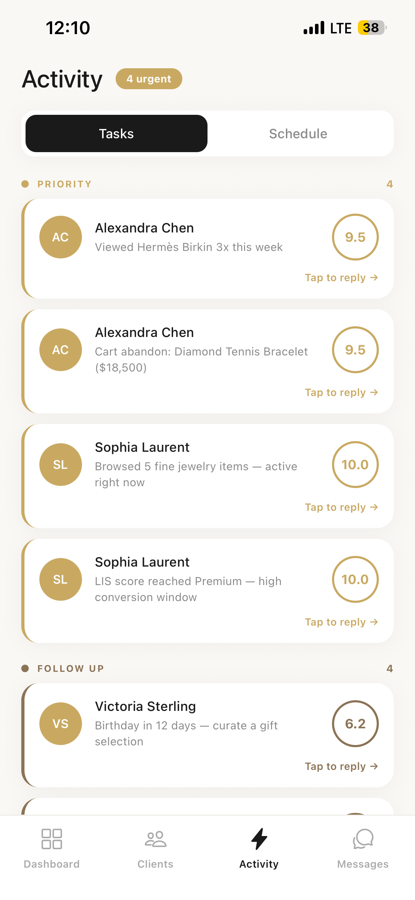
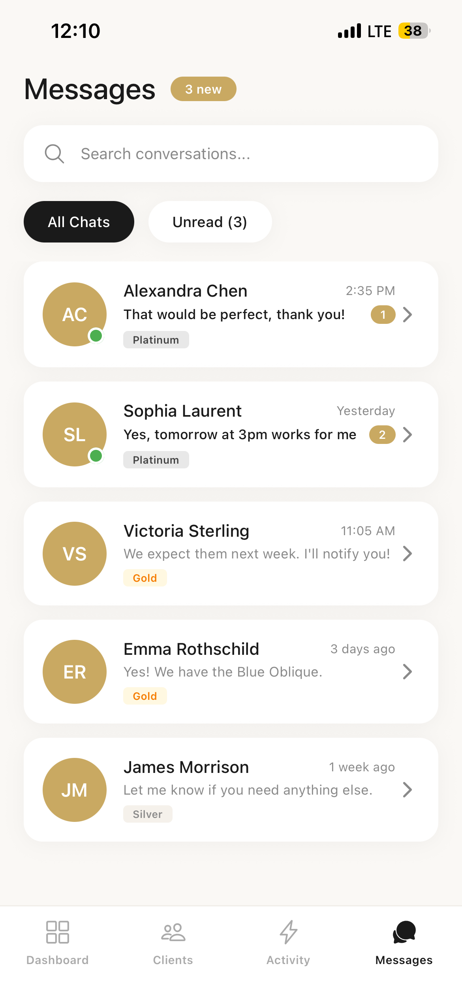

# LuxeSense AI

A full-stack luxury retail mobile application that connects high-end customers with personal sales advisors, powered by AI styling recommendations and a real-time customer intelligence engine.

> Built with React Native (Expo) · Node.js · MongoDB · Groq AI

---

## Screenshots

### Customer Experience

<table>
  <tr>
    <td align="center"><br/><sub>Splash</sub></td>
    <td align="center"><br/><sub>Login</sub></td>
    <td align="center"><br/><sub>Home Feed</sub></td>
    <td align="center"><br/><sub>Personalized Feed</sub></td>
  </tr>
  <tr>
    <td align="center"><br/><sub>Catalog</sub></td>
    <td align="center"><br/><sub>Women's Collection</sub></td>
    <td align="center"><br/><sub>Men's Collection</sub></td>
    <td align="center"><br/><sub>Brand View</sub></td>
  </tr>
  <tr>
    <td align="center"><br/><sub>Wishlist</sub></td>
    <td align="center"><br/><sub>AI Stylist</sub></td>
    <td align="center"><br/><sub>Advisor Chat</sub></td>
    <td align="center"><br/><sub>Notifications</sub></td>
  </tr>
</table>

### Advisor Dashboard

<table>
  <tr>
    <td align="center"><br/><sub>Advisor Dashboard</sub></td>
    <td align="center"><br/><sub>Client Portfolio (LIRA Scores)</sub></td>
    <td align="center"><br/><sub>Client Detail</sub></td>
    <td align="center"><br/><sub>Client Insights</sub></td>
  </tr>
  <tr>
    <td align="center"><br/><sub>Activity & Tasks</sub></td>
    <td align="center"><br/><sub>Messages</sub></td>
  </tr>
</table>

---

## Overview

LuxeSense AI simulates the digital experience of a luxury boutique. Customers browse curated collections from 8 top-tier brands, take a style quiz for personalized recommendations, chat with an AI stylist, and message their dedicated sales advisor. Advisors get a live dashboard showing each client's behavioral score, purchase frequency, and AI-generated outreach templates.

---

## Features

### Customer Flow
- **Personalized Home Feed** — products ranked by Style Quiz preferences (brand affinity + budget range)
- **AI Stylist Chat** — conversational styling assistant powered by Groq (Llama 3.1 8B), responds in the user's language (EN/TR)
- **Sales Advisor Chat** — real-time messaging with an assigned sales advisor, persisted to backend
- **Style Quiz** — 5-step onboarding quiz generating a LIS (Luxury Intent Score) profile
- **Product Catalog** — 68 products across 4 categories from 8 brands, with brand/price/category filters
- **Wishlist & Cart** — synced to backend on every change
- **Checkout & Orders** — full order flow with tax calculation, shipping options, and order history
- **Loyalty Tiers** — Silver / Gold (2,500 pts) / Platinum (7,500 pts) with push notification on upgrade
- **Notifications** — cart abandon reminders, loyalty upgrades, advisor recommendations
- **Localization** — full Turkish and English support (i18next)

### Advisor Flow
- **Customer Portfolio** — assigned clients ranked by CVI (Customer Value Index)
- **Behavioral Alerts** — real-time triggers: hot product views, cart abandons, wishlist inactivity, birthdays
- **Outreach Templates** — pre-written personalized messages per alert type
- **Advisor Chat** — message clients directly; history stored in MongoDB
- **Performance Dashboard** — sales targets, revenue tracking, commission breakdown, team ranking
- **Calendar** — appointment scheduling with clients
- **Tasks & Activity Log** — pending follow-ups, recent client interactions

---

## Tech Stack

| Layer | Technology |
|---|---|
| Mobile | React Native, Expo SDK 54 |
| Navigation | React Navigation (Stack + Bottom Tabs) |
| State Management | React Context API |
| Backend | Node.js, Express |
| Database | MongoDB Atlas |
| AI | Groq API — Llama 3.1 8B Instant |
| Authentication | JWT (7-day expiry) |
| Push Notifications | Expo Notifications |
| Localization | i18next (EN / TR) |
| Deployment | Render (backend), Expo Go (mobile) |

---

## Customer Intelligence Engine — LIRA

LIRA (Luxury Intent Real-time Analytics) is a two-layer scoring system that continuously evaluates each customer's value and engagement.

### Layer 1 — LIS (Luxury Intent Score)
Static score computed from the Style Quiz. Segments customers into **Premium**, **Selective**, or **Explorer** based on brand preferences, budget range, and style profile.

### Layer 2 — LIRA (Dynamic Behavioral Scoring)

**ES — Engagement Score (0–7)**

Weighted formula calculated from real-time behavioral events:

| Signal | Weight |
|---|---|
| Session minutes | 25% |
| App opens | 20% |
| Product views | 20% |
| Wishlist → Purchase conversion | 15% |
| Advisor recommendation acceptance | 20% |

**PF — Purchase Frequency (0–3)**

Rolling 30-day purchase window:
- Heavy (≥ 3 orders) → 3
- Regular (≥ 1 order) → 2
- Rare (0 orders) → 0

**CVI — Customer Value Index (0–10)**

```
CVI = ES + PF

≥ 7.0  →  high_priority
≥ 4.0  →  follow_up
< 4.0  →  low_priority
```

**Decay**

If a customer has been inactive for ≥ 15 days, their ES is multiplied by 0.8. This runs as a daily background job (cron, 03:00 UTC) to keep scores fresh and surface re-engagement opportunities for advisors.

**Event Types Tracked**

`app_open` · `session_end` · `product_view` · `purchase` · `chat_initiated` · `advisor_recommendation_accepted`

Events are batched client-side and flushed to the backend when the app goes to background. The backend is the authoritative score source; the frontend computes local estimates for instant UI feedback.

---

## Catalog

- **68 products** · price range $220 – $38,900
- **8 brands:** Hermès · Chanel · Louis Vuitton · Dior · Gucci · Cartier · Rolex · Prada
- **4 categories:** Bags · Watches · Jewelry · Accessories

---

## Screens (34 total)

**Customer (18):** Landing, Welcome, Login, Register, Home, Catalog, Product Details, Cart, Checkout, Order Success, Wishlist, AI Stylist, Chat (SA), Style Quiz, Profile, Notifications, Feedback, Settings

**Advisor (11):** Dashboard, Customers, Customer Detail, Chat List, Chat, Calendar, Tasks, Activity, Advisor Purchase History, Performance Dashboard, Sales Advisor Dashboard

**Shared (5):** Splash, Product Showcase, Stock Availability, Customer Feedback, Customer Profile

---

## Getting Started

### Prerequisites
- Node.js 18+
- Expo CLI (`npm install -g expo-cli`)
- Expo Go app on your phone

### Installation

```bash
git clone https://github.com/nisakamiloglu/LuxeSense-AI.git
cd LuxeSense-AI
npm install
```

Create a `.env` file in the root:

```
EXPO_PUBLIC_GROQ_API_KEY=your_groq_api_key_here
```

Get a free Groq API key at [console.groq.com](https://console.groq.com).

```bash
npx expo start
```

Scan the QR code with Expo Go.

### Backend (optional — app works with mock data fallback)

```bash
cd backend
cp .env.example .env  # fill in MONGODB_URI and JWT_SECRET
npm install
npm start
```

---

## Project Structure

```
LuxeSense-AI/
├── src/
│   ├── screens/          # 34 screen components
│   ├── context/          # AppContext — global state + LIRA engine
│   ├── services/         # API calls, Groq AI, push notifications
│   ├── constants/        # Mock data, image map, theme
│   ├── navigation/       # Stack + tab navigators
│   └── locales/          # EN / TR translations
├── backend/
│   ├── src/
│   │   ├── controllers/  # auth, orders, wishlist, chat, lira
│   │   ├── models/       # User, Product, Order, Wishlist, Message, Event, ScoreSnapshot
│   │   ├── routes/       # Express route definitions
│   │   └── services/     # ScoreCalculationService, DecayJob, BonusValidator
└── assets/
```

---

## API Endpoints

| Method | Endpoint | Description |
|---|---|---|
| POST | `/api/auth/register` | Register customer or advisor |
| POST | `/api/auth/login` | Login, returns JWT |
| GET | `/api/auth/me` | Get current user profile |
| GET | `/api/products` | List products (filter by brand/category/price) |
| POST | `/api/orders` | Place an order |
| GET | `/api/orders` | Get user's order history |
| POST | `/api/wishlist` | Add product to wishlist |
| DELETE | `/api/wishlist/:id` | Remove from wishlist |
| POST | `/api/lira/events/batch` | Ingest behavioral event batch |
| GET | `/api/lira/score` | Get current LIRA score |
| GET | `/api/lira/advisor/clients` | Advisor — get scored client list |
| GET | `/api/chat/:partnerId` | Get conversation messages |
| POST | `/api/chat` | Send a message |

---

## Academic Context

Developed as a capstone project for the Management Information Systems program. The project applies concepts from:
- **Systems Analysis & Design** — dual-role system architecture
- **Database Management** — MongoDB schema design, event sourcing
- **Business Intelligence** — behavioral scoring model (LIRA/LIS)
- **Agile Development** — sprint planning, backlog management
